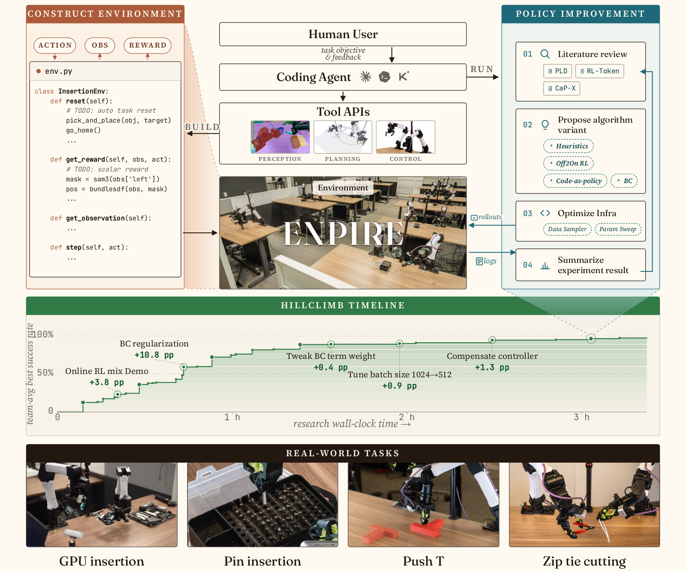

# ENPIRE: Agentic Robot Policy Self-Improvement in the Real World

<p align="center">
  
</p>

ENPIRE is a research harness for autonomous robot policy improvement on real hardware.
An LLM agent proposes hypotheses, writes or edits policy code, runs trials on the
physical robot, reads the outcome, and iterates — all without human intervention
between trials.

The loop is: **reset → execute → verify → record → refine.**

---

## Highlights

- **Code-as-Policy (CaP)** — the policy is Python. The agent edits skill scripts and
  re-runs them; success is measured by a vision or contact heuristic the agent cannot modify.
- **Online RL (PLD)** — a JAX actor trained live by SERL/HIL-SERL on real robot data.
  The agent tunes hyperparameters and reward shaping between trial budgets.
- **Both modes on the same station** — CaP and PLD tasks share the YAM arm, cameras,
  and calibration infrastructure.
- **One-command calibration** — `enpire station calibrate-all` launches arm servers,
  runs all three ChArUco/hand-eye sequences in tmux, and writes the calibrated XML.
- **Agent-readable** — `.codex/README.md` is a self-contained onboarding file;
  an agent given only the repo URL can install, calibrate, and run auto-research
  end-to-end.

### Demonstrated tasks

| Task | Mode | Policy | Notes |
|------|------|--------|-------|
| Prompted pickup | CaP | `cap/saved_scripts/examples/pick_object.py` | One generic real-world pickup script |
| **Push-T** | **CaP + PLD** | `cap/saved_scripts/pusht/` · `enpire/policy/rl/pusht/` | **Fully reproducible end-to-end autoresearch example** — includes CaP reset loop, vision reward, RL training, and 3D-printable T-block (`robot/models/objects/meshes/t_block.stl`) |
| GPU insertion | CaP | `cap/saved_scripts/skill_library/` | — |
| Pin insertion | PLD (online RL) | `enpire/policy/pld/` | — |

---

## Install

**Requirements:** Python 3.11, [uv](https://docs.astral.sh/uv/), Linux x86-64, tmux.

```bash
# --recurse-submodules is required: cuRobo is a submodule that uv resolves as an
# editable path dependency, so without it every `uv sync` and `uv run` fails with
# "third_party/curobo does not appear to be a Python project".
git clone --recurse-submodules https://github.com/NVlabs/ENPIRE.git
cd ENPIRE

# Already cloned without it? Populate the submodule now:
git submodule update --init --recursive

# Hardware-free baseline (simulation + tests)
uv sync --extra dev

# Full real-robot stack
uv sync --extra dev --extra cap --extra vision --extra vision-local \
        --extra grasping-local --extra planning --extra planning-local \
        --extra control-yam --extra camera-realsense --extra calibration \
        --extra real-rl

# JAX PLD learner/actor (isolated environment)
uv sync --project enpire/policy/pld/runtime --extra dev
```

Run the hardware-free hello-world to verify the install:

```bash
uv run enpire examples run 00_hello_environment
```

Full installation notes: [`enpire/env/docs/INSTALL.md`](enpire/env/docs/INSTALL.md)

---

## Station setup

One-time setup per physical station (YAM arms + cameras):

```bash
export ENPIRE_YAM_MODEL_ROOT=/path/to/yam-model-assets

uv run enpire station init     --station my-yam-station-name
uv run enpire station register --station my-yam-station-name   # detects CAN/USB serials
uv run enpire station calibrate-all \
  --station my-yam-station-name \
  --output-xml /path/outside/repo/station_calibrated.xml \
  --confirm-motion
```

The `calibrate-all` command starts both arm servers automatically in a tmux
session, runs the intrinsic → extrinsic → hand-eye sequence, and writes the
calibrated MuJoCo XML to the path you specify.

Calibration is the one step that needs a person: it requires a printed ChArUco
board, mounted on the gripper for the top camera and fixed in the world for the
wrist cameras. Generate a board matched to this station's constants with

```bash
uv run python -m enpire.env.forge.yam.calibration.make_board --output charuco_board.png
```

and read [`enpire/env/docs/CALIBRATION_BOARD.md`](enpire/env/docs/CALIBRATION_BOARD.md)
before printing — a board printed at anything other than 100% scale biases every
resulting transform and nothing downstream will warn you. If your board differs
from the 5×5 / 40 mm default, pass `--squares-x`, `--squares-y`,
`--square-length`, and `--marker-length` to `station calibrate-all`.

### Binding cameras to roles

Cameras are addressed by **role** (`top`, `left`, `right`). List the attached
librealsense serials, and identify each by covering a lens and watching which
stream darkens:

```bash
uv run python -c "import pyrealsense2 as rs; [print(d.get_info(rs.camera_info.serial_number)) for d in rs.context().query_devices()]"
```

Bind them with any one of these — `resolve_realsense_serial` tries them in
order, so an earlier one wins:

| | How | Notes |
|---|---|---|
| 1 | `CAP_<ROLE>_REALSENSE_SERIAL=<SERIAL>` | one-off, highest priority |
| 2 | `~/.local/share/enpire/camera_aliases.json`, `{"<SERIAL>": "video_top", ...}` | **recommended**, no root, stays out of Git |
| 3 | udev rule → `/dev/video_<role>` | persistent, needs admin |

```
# udev: ATTRS{serial} is the USB serial, NOT the librealsense one
# (udevadm info -a -p /sys/class/video4linux/videoN | grep -m1 'ATTRS{serial}')
# A D405 exposes six nodes, so ATTR{index}=="0" pins one per camera.
SUBSYSTEM=="video4linux", ATTRS{idVendor}=="8086", ATTRS{serial}=="<USB_SERIAL>", ATTR{index}=="0", SYMLINK+="video_top"
```

Verify, and record the serials in the station profile's `cameras:` block:

```bash
uv run python -c "from enpire.env.forge.robot.camera_factory import resolve_realsense_serial as r; print([(n, r(n)) for n in ('top','left','right')])"
```

> Calibration needs none of this (`resolve_serial` passes a serial straight
> through) — only the CaP runtime resolves by role, so a station can calibrate
> fine yet still fail a pick with `No symlink: /dev/video_left`.

> The CaP runtime defaults its top-camera backend to **ZED**
> (`robot/models/station/paths.py`). On a RealSense station set
> `CAP_TOP_CAMERA_BACKEND=realsense`, or model loading fails looking for
> `station_zed2itop_calibrated.xml`.

---

## Running tasks

### Quick reference: a 2D pick from a cold machine

```bash
# 0. station environment (serials, camera backend, table plane) in one file
set -a; source station.env; set +a

# 1. all three services in ONE call (motion-capable: it starts the arm servers).
#    Two separate `services start` calls both default to the tmux session
#    "enpire", and the second aborts with "session already exists".
uv run enpire services start --services sam3,curobo,yam \
  --station my-yam-station-name --confirm-motion

# 2. wait for all four ports — nothing below works until they are up
curl -s localhost:6767/health          # {"status":"ok","model_loaded":true,...}
ss -ltn | grep -E '6767|8611|11333|11334'

# 3. pick
ENPIRE_PICK_GRASP_MODE=2d ENPIRE_PICK_CAMERA=top ENPIRE_PLANNING_SPEED=1.0 \
uv run enpire cap run pickup --prompt "<object>" \
  --station my-yam-station-name --confirm-motion
```

`ENPIRE_PLANNING_SPEED` scales motion (built-in default `1.5`). Drop it well
below `1.0` — `0.25` is about 6x slower — for a first run on new hardware or an
untested grasp height, so there is time to hit the e-stop. Each section below
expands on one of these steps.

### Start services (perception + planning + arm servers)

```bash
uv run enpire services start --profile cap-real       # AnyGrasp, cameras
uv run enpire services start --profile robot \
  --station my-yam-station-name --confirm-motion      # YAM arm servers
```

A pick needs **three** services up. `cap-real` includes AnyGrasp, which needs a
machine-locked licence issued per machine and takes about a week to obtain — see
[`enpire/env/docs/ANYGRASP_SETUP.md`](enpire/env/docs/ANYGRASP_SETUP.md). A
station without one starts just what a 2D grasp uses:

```bash
uv run enpire services start --services sam3,curobo,yam \
  --station my-yam-station-name --confirm-motion
```

Start them in **one** call. Every `services start` writes to the tmux session
named by `--session` (default `enpire`) and refuses to reuse an existing one, so
a second call aborts with `tmux session 'enpire' already exists` — having
started nothing. To add a service to a running set, either give it its own
`--session`, or `tmux kill-session -t enpire` and start the full set again.

| Service | Port | Needed for |
|---|---|---|
| `sam3` | 6767 | text-prompted segmentation |
| `curobo` | 8611 | collision-aware motion planning ([setup](enpire/env/docs/CUROBO_SETUP.md)) |
| arm servers | 11333 / 11334 | left / right YAM control |

Both model services warm up on first start and are silent while they do it, so
verify before running a task rather than watching an idle terminal:

```bash
curl -s localhost:6767/health          # {"status":"ok","model_loaded":true,...}
ss -ltn | grep -E '6767|8611|11333|11334'
```

`sam3` is started with `--preload` so weights load at boot (~3 GB VRAM) instead
of on the first request. `curobo` JIT-compiles its warp kernels on first launch
— that takes tens of seconds and grows `~/.cache/warp/<version>` to a few
hundred MB; later starts reuse the cache. Until port 8611 is listening,
`freespace_move` blocks retrying the connection and **the arm never moves**,
with no error.

Note that 8611 is Portal RPC, not HTTP — `curl localhost:8611/health` will not
work, so check it with `ss` as above. Only `sam3` on 6767 answers HTTP.

### Code-as-Policy tasks

```bash
uv run enpire cap run pickup --prompt "blue cube" \
  --station my-yam-station-name --confirm-motion
```

#### 2D top-down grasps

`pickup` defaults to the AnyGrasp 6-DoF backend, which needs a machine-locked
licence. The calibrated top-down sampler is the alternative, and for **flat or
short objects lying on a surface it usually works better than AnyGrasp** — a
top-down approach is the right grasp for them anyway, and it depends only on
segmentation plus a known table plane, never on depth:

```bash
ENPIRE_PICK_GRASP_MODE=2d ENPIRE_PICK_CAMERA=top \
uv run enpire cap run pickup --prompt "blue cube" \
  --station my-yam-station-name --confirm-motion
```

This matters on short-baseline cameras: a D405 has a ~18 mm stereo baseline, so
depth error grows as `z²/(baseline·fx)` — tens of mm by 0.5 m and ~90 mm at 1 m.
Point-cloud modes (`obb`) cannot work from a top camera at table range, while
`2d` is unaffected because segmentation is a colour operation.

Two values set the grasp height, and `2d` grasps are only as good as they are:

| Variable | Default | Meaning |
|---|---|---|
| `TABLE_SURFACE_Z_M` | `0.75` | table plane in base frame |
| `ENPIRE_2D_GRASP_Z_OFFSET_M` | `0.0` | height **above** that plane to grasp at |

The commanded grasp z is their sum — the offset is not a clearance floor, it is
written directly into every candidate. It defaults to `0.0`, fingertips at the
table plane, which is what flat and short objects need.

Override it with any constant to grasp higher up — roughly half the object's
height closes the fingers around its middle:

```bash
ENPIRE_2D_GRASP_Z_OFFSET_M=0.03 \
ENPIRE_PICK_GRASP_MODE=2d ENPIRE_PICK_CAMERA=top \
uv run enpire cap run pickup --prompt "mug" --station my-yam-station-name --confirm-motion
```

| Offset | Grasps at | Suits |
|---|---|---|
| `0.0` (default) | table plane | flat objects, thin or short items |
| `0.015` | 15 mm up | a ~30 mm tall object, gripped mid-height |
| `0.03` | 30 mm up | taller objects such as a mug or box |

Measure `TABLE_SURFACE_Z_M` rather than trusting the default. Detect a ChArUco
board lying flat on the table and transform its pose by the calibrated
`T_base_from_camera`; do **not** use depth on a short-baseline camera. Note the
plane also sets the grasp's **lateral** position — the mask centroid is
intersected with it along the camera ray — so on an off-nadir camera a wrong
height shifts x/y as well as z.

Both variables belong in the station's environment file, not in the command.

> **Check this on a new station before running at speed.** Unlike the AnyGrasp
> path — which clamps every proposal up to `ANYGRASP_MIN_PLANNER_Z_M`
> (default `0.80`, i.e. 50 mm above the default table plane) — the 2D path
> applies **no floor at all**: `TABLE_SURFACE_Z_M + ENPIRE_2D_GRASP_Z_OFFSET_M`
> is commanded verbatim. With both defaults that is `0.75`, right at the table
> plane, so an over-estimated `TABLE_SURFACE_Z_M` drives the fingertips into the
> table. Measure the plane (§ above), and make the first run on new hardware
> with `ENPIRE_PLANNING_SPEED=0.25`.

### Push-T (CaP auto-research)

```bash
export RL_DATA_PATH=/path/outside/repo/rl-data

# Supervisor runs the CaP reset script in a loop and records per-trial results
bash tmux/realworld_rl/rl_pusht.sh --station my-yam-station-name --use-spacemouse

# Score a completed run
uv run enpire rl score --data-dir "$RL_DATA_PATH/<run-id>" --window 50 --plot
```

### Pin insertion (PLD online RL)

```bash
export RL_DATA_PATH=/path/outside/repo/rl-data
export ENPIRE_YAM_STATION=my-yam-station-name

uv run enpire rl control health
uv run enpire rl control pause   --confirm-control
uv run enpire rl control restart --confirm-control        # → prints run_dir
uv run enpire rl learner --task pin_insertion             # terminal 1
uv run enpire rl actor   --task pin_insertion             # terminal 2
bash tmux/realworld_rl/rl_gear.sh \
  --task pin_insertion --station my-yam-station-name --use-spacemouse  # terminal 3
uv run enpire rl control resume  --confirm-control
```

---

## Repository layout

```
ENPIRE/
├── assets/                   figures for this README
├── enpire/
│   ├── env/
│   │   ├── forge/            runtime, YAM station, CaP runner and released scripts
│   │   ├── examples/         learning path + task capsules
│   │   └── docs/             INSTALL.md, REAL_WORLD_WORKFLOWS.md, NEW_TASK.md
│   └── policy/
│       ├── pld/              JAX PLD actor/learner (isolated runtime)
│       └── autoresearch_instruction.md
├── tmux/realworld_rl/        supervisors and RL launchers
├── third_party/              vendored: cuRobo, PyRoki, i2rt
├── .codex/README.md          agent onboarding (full setup + auto-research)
└── AGENTS.md                 coding-agent implementation rules
```

---

## Adding a new task / launching auto-research

See [`enpire/env/docs/NEW_TASK.md`](enpire/env/docs/NEW_TASK.md) for the
complete guide: environment contract, file templates, per-iteration loop,
allowed edit surface, and pre-live checklist.

---

## Development

```bash
uv run pytest -q tests/enpire
uv run ruff check enpire tests/enpire
```

Consult `enpire/env/docs/source_provenance.yaml` before moving code migrated
from upstream Forge branches.  Add a characterization test before refactoring.

---

## License

Copyright (c) 2025, NVIDIA CORPORATION & AFFILIATES. All rights reserved.
Licensed under the [Apache License 2.0](LICENSE).

See [THIRD_PARTY_NOTICES.md](THIRD_PARTY_NOTICES.md) and
[THIRD_PARTY_LICENSES.md](THIRD_PARTY_LICENSES.md) for third-party attributions.

## Contributing

See [CONTRIBUTING.md](CONTRIBUTING.md). All contributions must be signed off
under the Developer Certificate of Origin and licensed under Apache-2.0.

## Security

To report a security vulnerability, visit
[https://www.nvidia.com/en-us/security/](https://www.nvidia.com/en-us/security/).
See [SECURITY.md](SECURITY.md) for credential and hardware safety rules.
